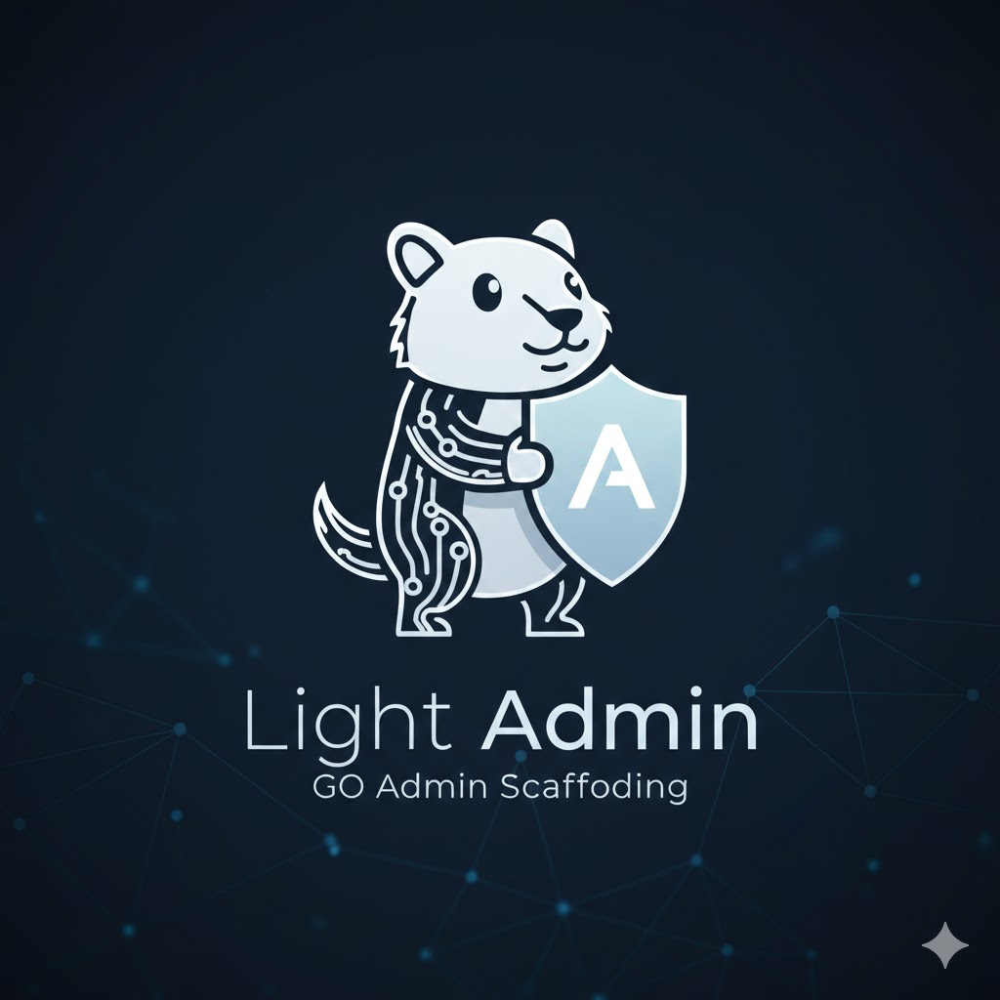

<div align="center">
  

  <h1>Light Admin</h1>

  <p>
    <strong>A Lightweight and Elegant Backend Management Solution</strong>
  </p>

  <p>
    RBAC Admin Scaffolding built with Echo + sqlc + Casbin + Uber-FX
  </p>

  <p>
    English | <a href="https://github.com/top-system/light-admin/blob/main/README.md">简体中文</a>
  </p>

  <p>
    
    
    
    
    
  </p>
</div>

---

## ✨ Features

### Core Features
- 🔐 **Authentication** - JWT Token authentication with refresh support
- 👥 **User Management** - CRUD operations, status management, password reset
- 🎭 **Role Management** - Flexible role configuration, multi-role support
- 📋 **Menu Management** - Dynamic menu configuration, multi-level menus
- 🏢 **Department Management** - Tree-structured organization management
- 🔑 **Access Control** - Permission-based RBAC access control with caching
- 📝 **Operation Logs** - Complete audit logging
- 📢 **Announcements** - System notifications and announcements
- ⚙️ **System Config** - Dynamic system parameter configuration
- 📚 **Dictionary** - Data dictionary maintenance

### Extended Features
- 📤 **File Upload** - Local storage, MinIO, Aliyun OSS support
- ⏰ **Scheduled Tasks** - Flexible cron job scheduling
- 📥 **Task Queue** - Async task processing with retry, persistence, and state recovery
- ⬇️ **Download Manager** - aria2/qBittorrent integration, deeply integrated with queue system
- 🔌 **WebSocket** - STOMP protocol-based real-time communication with broadcast and P2P messaging

### Technical Features
- 🚀 **High Performance** - Based on Echo framework with efficient routing
- 📦 **Dependency Injection** - Uber-FX based dependency injection
- 📖 **API Documentation** - Integrated Swagger auto-generation
- 🔧 **Modular Design** - Clean code structure, easy to extend
- 🛡️ **Security** - Comprehensive security middleware support
- 💾 **Multi-Database** - MySQL, PostgreSQL, SQLite support
- 🗄️ **Multi-Cache** - Redis and in-memory cache support

---

## 📁 Project Structure

```
light-admin/
├── api/                    # API Layer
│   ├── middlewares/        # Middlewares
│   ├── platform/           # Platform module (file upload, WebSocket, etc.)
│   └── system/             # System module (user, role, menu, etc.)
├── bootstrap/              # Application bootstrap
├── cmd/                    # CLI entry points
├── config/                 # Configuration files
├── docs/                   # Documentation & Swagger
├── errors/                 # Error definitions
├── lib/                    # Core libraries
├── models/                 # Data models
│   ├── database/           # Database model base
│   ├── dto/                # Data transfer objects
│   ├── platform/           # Platform module models
│   └── system/             # System module models
├── pkg/                    # Utility packages
│   ├── crontab/            # Scheduled tasks
│   ├── downloader/         # Downloader (aria2/qBittorrent)
│   ├── queue/              # Task queue
│   ├── websocket/          # WebSocket (STOMP protocol)
│   └── ...                 # Other utilities
└── tests/                  # Test files
```

---

## 🚀 Quick Start

### Requirements

- Go 1.21+
- Node.js 16+ (for frontend)
- Optional: MySQL 5.7+ / PostgreSQL 12+ / SQLite 3
- Optional: Redis 6.0+ (uses in-memory cache if not configured)

### Installation

```bash
# Clone the repository
git clone https://github.com/top-system/light-admin.git
cd light-admin

# Copy configuration file
cp config/config.yaml.default config/config.yaml

# Edit configuration (defaults to SQLite, works out of the box)
vim config/config.yaml

# Initialize database
go run . migrate

# Setup menu data
go run . setup

# Start the service
go run .
```

### Using Docker

```bash
# Build image
docker build -t light-admin .

# Run container
docker run -d -p 2222:2222 \
  -v ./config:/app/config \
  -v ./data:/app/data \
  light-admin
```

---

## 📖 Documentation

| Document | Description |
|----------|-------------|
| [API Docs](docs/swagger.yaml) | Swagger API documentation |
| [Task Queue](docs/queue.md) | Async task queue guide |
| [Crontab](docs/crontab.md) | Scheduled tasks guide |
| [Downloader](docs/downloader.md) | aria2/qBittorrent integration guide |
| [WebSocket](docs/websocket.md) | Real-time communication guide |

---

## ⚙️ Configuration

### Basic Configuration (SQLite + Memory Cache, Zero Dependencies)

```yaml
Name: light-admin

HTTP:
  Host: 0.0.0.0
  Port: 2222

# SQLite database (works out of the box)
Database:
  Engine: sqlite
  Name: ./data/app.db
  TablePrefix: t
  MaxLifetime: 7200
  MaxOpenConns: 1
  MaxIdleConns: 1

# In-memory cache (no Redis required)
Cache:
  Type: memory
  KeyPrefix: app
```

### MySQL + Redis Configuration

```yaml
Database:
  Engine: mysql
  Host: 127.0.0.1
  Port: 3306
  Name: light_admin
  Username: root
  Password: your_password

Cache:
  Type: redis
  Host: 127.0.0.1
  Port: 6379
  Password: ""
```

### Extended Features Configuration

```yaml
# Task Queue
Queue:
  Enable: true
  Name: "default"
  WorkerNum: 2
  MaxRetry: 3

# Downloader
Downloader:
  Enable: true
  Type: aria2  # aria2 or qbittorrent
  Aria2:
    Server: "http://localhost:6800/jsonrpc"
    Token: ""
    TempPath: "./downloads"
```

---

## 🛠️ Development Commands

```bash
# Build
go build -o light-admin .

# Run
go run .

# Database migration
go run . migrate

# Initialize data
go run . setup

# Generate Swagger docs
swag init

# Run tests
go test ./...
```

---

## 🗺️ Roadmap

- [x] User authentication & access control
- [x] Dynamic menus & role management
- [x] Department & organization structure
- [x] System configuration & dictionary
- [x] File upload (Local/OSS)
- [x] Async task queue
- [x] Scheduled task scheduling
- [x] Downloader integration (deeply integrated with queue)
- [x] WebSocket real-time communication
- [x] Permission caching optimization
- [x] SQLite support
- [ ] Operation log auditing improvements
- [ ] Workflow engine
- [ ] Message push
- [ ] Data import/export

---

## 🤝 Contributing

Contributions are welcome! Feel free to submit PRs and Issues.

1. Fork this repository
2. Create your feature branch (`git checkout -b feature/AmazingFeature`)
3. Commit your changes (`git commit -m 'Add some AmazingFeature'`)
4. Push to the branch (`git push origin feature/AmazingFeature`)
5. Open a Pull Request

---

## 📄 License

This project is licensed under the [MIT](LICENSE) License.

---

## 🔗 Links

- [Frontend Project](https://github.com/top-system/light-admin-ui)
